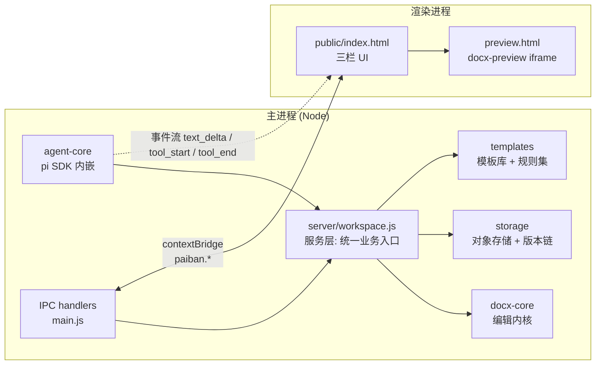

# paiban-studio

**AI 驱动的 Office 排版本地工作台（Word MVP）**——上传排版混乱的 docx + 选/传模板 → 用自然语言指挥 AI 直接修改文档 → 秒级实时预览 → 每次改动自动存版本、可回滚。全程本地运行，公文不出内网。

## 快速开始（开发者）

> 前置：Node ≥ 22.19（见 [部署文档 · 环境要求](#环境要求)）。

```bash
npm install        # 安装依赖（Electron / pi SDK / docx 内核）
npm test           # 单元 + 回归测试（node:test，37 用例）
npm start          # 启动 Electron 开发模式（三栏工作台）
npm run preview    # 规则集组件画廊预览页 → http://localhost:4173/preview/ruleset-gallery.html
```

## 状态 · MVP 进度边界

MVP 规格已确认（2026-08-02，`docs/mvp-spec.md`），进度边界如下（截至 2026-08-02）：

| 里程碑 | 状态 | 说明 |
|---|---|---|
| 模板规则集原型（issue #1） | ✅ 已完成（`main`） | 识别/样式两文件 schema + 组件画廊预览页 |
| round-trip 保真 spike（MVP 第一里程碑） | ✅ 已达成 | `test/fixtures/` 19 份真实 Word/WPS 产出样本，未编辑 round-trip 逐部件无损 + build 幂等 |
| 核心五模块（issue #2） | ✅ 已实现并合入 `main` | 编辑内核 / 存储版本链 / 模板层 / agent 接入 / 三栏 UI，37 用例（36 通过、1 真实 LLM e2e 默认跳过） |
| 真实 LLM 链路测试 | ⏳ 待做 | `PAIBAN_E2E=1` + 模型凭证启用（默认跳过）；mock LLM 全链路已在默认套件覆盖 |
| Word/WPS 双端人工验证 | ⏳ 待做 | 发布前人工打开确认版式一致（spec 首要风险收口） |
| electron-builder 打包分发 | ⏳ 待做 | 三平台（Win NSIS / macOS DMG / Kylin AppImage） |

MVP 边界（In / Out of Scope 精简版，完整版见 `docs/mvp-spec.md`）：

- **只做 Word `.docx`**；Excel / PPT 进雾区。
- **全本地优先**：只处理上传副本（原稿零改动），支持 Anthropic / OpenAI 兼容端点（含 Ollama、vLLM、本地网关），可完全离线。
- **不做**：LibreOffice 编辑层、mammoth 语义抽取、批量处理、多人协同、Web/移动端、旧格式 `.doc/.wps`、PDF 导出、会话持久化。

## 部署文档

面向开发者：如何在开发机、CI 与内网环境中部署运行。

### 环境要求

| 项 | 要求 |
|---|---|
| Node.js | ≥ 22.19（`package.json` `engines` 强制） |
| npm | 随 Node 分发（≥ 10） |
| 平台 | Windows / macOS / Kylin（Linux，信创合规） |
| Electron | ≥ 35（作为依赖安装，无需系统级安装） |
| 显示环境 | 常规运行需桌面环境；CI / 无显示环境用 headless 冒烟（见下） |

### 安装

```bash
git clone <repo> paiban-studio && cd paiban-studio
npm install
```

安装产物：Electron 二进制、`@earendil-works/pi-coding-agent` SDK、`pizzip` / `fast-xml-parser`（编辑内核）、`docx-preview`（预览渲染）。均从 npm 拉取；内网环境需预先配置 npm 镜像或离线仓库。

### 开发模式运行

```bash
npm start          # 启动 Electron（三栏工作台）
npm run preview    # 规则集组件画廊静态预览页（http://localhost:4173）
npm test           # 全量测试
```

### 配置 LLM Provider

配置优先级：**界面配置 > 环境变量 > 默认值**（`src/server/workspace.js`，R4）。默认值：`deepseek / deepseek-v4-flash`（凭证回落 `DEEPSEEK_API_KEY`）。

**方式一 · 环境变量**（适合 CI / 内网脚本）：

| 变量 | 说明 |
|---|---|
| `PAIBAN_PROVIDER` | `anthropic` \| `openai` \| `deepseek` \| `gateway`（OpenAI 兼容网关） |
| `PAIBAN_MODEL` | 模型 ID，如 `deepseek-v4-flash` / `deepseek-v4-pro` / `claude-sonnet-4-5` |
| `PAIBAN_BASE_URL` | 网关必填，如 `http://localhost:11434/v1`（Ollama）、vLLM、One-API |
| `PAIBAN_API_KEY` | 凭证（亦回落 `DEEPSEEK_API_KEY` / `ANTHROPIC_API_KEY` / `OPENAI_API_KEY`） |

**方式二 · 界面配置**：顶栏「模型设置」对话框，保存到 `<userData>/paiban-studio/config.json`，保存后重载 agent 生效。

> 安全：凭证只存本地配置文件且**不回传渲染层**（IPC 只暴露 `hasApiKey` 布尔）。`models.json` 经环境变量插值注入 API Key，不落明文。agent SDK 缺失或无凭证时**优雅降级**为无 agent 模式，工作台其余功能不受影响。

### 数据目录与安全边界

数据统一落在 Electron `userData/paiban-studio/`（`src/main.js`）：

```
<userData>/paiban-studio/
├── docs/          # 工作文档版本链（docs/<docId>/versions.json）
├── templates/     # 模板资产库（meta / recognizers / styles 三文件）
├── objects/       # 对象存储（sha256 内容寻址，跨文档去重）
├── agent/         # agent 运行时（auth.json / models.json）
└── config.json    # 界面配置（含凭证）
```

- **原稿零改动**：上传只取副本 buffer 入库，系统文件对话框打开的原路径不写。
- **版本兜底**：每次成功编辑自动快照（内容无变化不产生空版本，幂等）；回滚记录为新版本。
- **权限门**：agent 仅能经自研工具改文档（内置文件工具不入白名单），不提供进程级沙箱。

### Headless 冒烟（CI / 无显示环境）

```bash
PAIBAN_SMOKE=1 npm start
```

不弹窗口，执行 service 级全链路（上传 → 编辑 → 大纲 → 版本 → 回滚 → 模板），`exit 0/1`，输出 `[SMOKE] {...}` JSON。适合作为流水线冒烟门禁。

### 构建与分发

```bash
npm run dist       # electron-builder，输出到 out/
```

`package.json` 已配置 `appId`、`productName: 排版工作台`，三平台目标：Win `nsis` / macOS `dmg` / Linux `AppImage`。注意：

- electron-builder 产物带平台属性，**需在目标平台构建**（或用 CI 矩阵三平台分别出包）。
- 信创（Kylin）走 Linux 目标；产物为 AppImage，内网环境可离线分发。
- 版本号 / 图标 / 签名未收口，属 MVP 后置项。

### 真实 LLM 链路测试

```bash
# DeepSeek（默认 provider）
PAIBAN_E2E=1 DEEPSEEK_API_KEY=sk-... npm run test:e2e-agent
# Anthropic 直连
PAIBAN_E2E=1 ANTHROPIC_API_KEY=sk-... npm run test:e2e-agent
# OpenAI 兼容网关
PAIBAN_E2E=1 PAIBAN_BASE_URL=http://... PAIBAN_API_KEY=... PAIBAN_MODEL=... npm run test:e2e-agent
```

断言 agent 收到「标题改黑体三号居中」后**经 doc_edit 工具真正落到文档**（新版本 + `/body/p[1]` 变黑体/16pt/居中），不听 agent 自述。

## 开发指南

面向开发者：架构、模块、唯一 seam、测试与协作工作流。

### 架构与进程模型

Electron 双进程 + IPC（R1：无本地 HTTP）。主进程跑 agent 编排 + docx 编辑内核 + 存储层；渲染进程跑 UI + iframe 预览。



所有写路径收敛到 `applyEdits(buffer, commands)` 一个 seam：agent 工具、模板实例化、手动编辑、`normalize` 全文重排最终都走它。

### 目录结构

```
src/
├── main.js               # Electron 主进程：窗口 / IPC 注册 / agent 初始化 / headless 冒烟
├── preload.mjs           # contextBridge 白名单 API（paiban.*）
├── server/workspace.js   # 服务层：文档/版本/模板/配置统一入口（headless 可测）
├── docx-core/            # 编辑内核（唯一 seam applyEdits 所在）
│   ├── applyEdits.js     #   seam + 命令分派 + 生成后自检
│   ├── primitives.js     #   段落/run/节属性、findReplace、结构原语
│   ├── numbering.js      #   numbering.xml 多级编号封装
│   ├── model.js          #   路径寻址（/body/p[N]/r[M]）
│   ├── ooxml.js          #   OOXML 元素工具
│   ├── docx.js           #   部件容器 open/toBuffer/markDirty
│   └── xml.js            #   preserveOrder 解析 / 保序序列化（round-trip 关键）
├── storage/              # objectStore(sha256) + versionStore(版本链)
├── templates/            # 上传→解析→规则集反推→实例化
├── agent-core/           # bridge(pi SDK) + tools(4 自研工具)
└── ruleset/              # 规则集 schema（Node/浏览器共用校验）
public/                   # 无框架三栏前端（HTML/CSS/JS）
templates/rulesets/       # 内置公文默认规则集（gongwen-default）
test/                     # node:test 用例 + fixtures/ 19 份真实样本
```

### 唯一 seam：`applyEdits(docxBuffer, commands)`

```js
const { buffer, result } = applyEdits(docxBuffer, commands);
// result: { applied: [...], errors: [...], selfCheck: { ok, parts } }
```

- 命令按数组顺序应用；**单条失败不中断**，结构化错误收集（含自愈建议 `suggestion`）。
- 每条成功命令写入 `result.applied` 摘要，供对话层展示「AI 改了什么」。
- 产出前**生成后自检**：重解析全部件 + `document.xml` 结构冒烟。

**命令协议速查**：

| command | 目标 | 用途示例 |
|---|---|---|
| `set` | `path` 或 `match:{text}` | 段落/run/节属性、批量正则命中（「正文统一…」） |
| `add` / `remove` / `move` | `parent` / `path` | 结构原语 |
| `findReplace` | `find` / `replace` | 自动拆分 run 的跨 run 替换 |
| `normalize` | `ruleset:{rules}` | 规则集驱动全文重排（模板层供给） |
| `numbering` | `action: define/attach/clear` | 多级编号 |
| `pageNumber` | `action:"footer"` | 页脚页码字段 |

路径寻址：`/body/p[1]`、`/body/p[1]/r[2]`（1 起，按同标签兄弟计数）。`set` 支持段落 `props.align / lineSpacingPt / firstLineChars / spacingBeforePt / pageBreakBefore / outlineLevel`、run `props.eastAsia / ascii / sizePt / bold / italic / underline / color`、节 `props.marginsCm / pageSize / orientation`。

### 测试策略

原则（spec 明确）：**只测外部行为，不测实现细节**——所有编辑语义都从 `buffer → buffer` 外部行为断言，不 inspect 内部文档模型。测试模块：

| 模块 | 覆盖 |
|---|---|
| `test/roundtrip.test.js` | 第一里程碑：19 份真实样本 round-trip 无损 + build 幂等 + dirty 语义 |
| `test/edits.test.js` | 8 类命令原语行为 + 错误处理 + 生成后自检 |
| `test/storage.test.js` | 快照幂等 / 回滚语义 / 内容寻址去重 |
| `test/templates.test.js` | 占位符提取 / 规则集反推 / 实例化 / 规则集→命令 |
| `test/workspace.test.js` | service 级端到端 + 配置优先级 + agent 工具链（无 LLM） |
| `test/e2e-agent.test.js` | 真实 LLM 链路（`PAIBAN_E2E=1` 启用，默认跳过） |

回归集要求：内置真实 Word/WPS 产出的 `.docx` 样本，round-trip 后重解析校验 + docx-preview 渲染冒烟；发布前双端人工打开验证。

### 开发工作流（强制）

见 `AGENTS.md`：

- **卡片必须用 git worktree 隔离开发**，禁止在 `main` 直接改代码（`.claude/worktrees/<card-id>` + 独立分支）。
- **只有测通的才允许合入**：实现 + 相关测试无回归后才合并到 `main`。
- 合入后清理 worktree；多 agent 并行时每卡片各占一个 worktree。

### MVP 边界（开发注意）

- 新增命令/原语时，先看 `applyEdits` 分派表与 `primitives.js`，尽量复用现有原语组合，避免绕过 seam 直接改 XML。
- 涉及 `numbering.xml` 的改动是 spec 标记的首要风险之一，必须补 round-trip 回归。
- 前端遵循 Figma design system（`docs/design/figma/DESIGN.md`）：界面 chrome 严格黑白、pill/圆形几何、8px 间距体系、`dashed 2px` focus outline。动手前先读全文。

## 文档

| 文档 | 内容 |
|---|---|
| `docs/mvp-spec.md` | MVP 实现边界报告：Problem/Solution/User Stories/全部拍板决策（D1–D9 + R1–R4）/模块接口/测试策略 |
| `docs/research/` | 三份调研报告：OfficeCLI 借鉴范式、pi agent 接入、OOXML 编辑层与预览选型 |
| `docs/knowledge/wfp-formatting-rules.md` | wfp_core 排版识别规则知识提取（模板规则集的知识来源） |
| `docs/legacy-assets.md` | 旧库资产盘点：可复用代码/借鉴范式/知识资产/废弃清单（逐文件级） |
| `reference/OfficeCLI` | OfficeCLI 本地浅克隆副本（一手源码，agent 实现期参考用；`.gitignore` 排除，不进仓库） |
| `docs/design/figma/DESIGN.md` | Figma design system 完整规范（前端审美唯一权威，open-design 快照） |
| `AGENTS.md` | agent 工作约定：卡片实现工作流（worktree 强制）、Figma design system 审美规范 |

## 技术决策速览

- **形态**：Electron ≥ 35 桌面应用（Node ≥ 22.19），无框架纯 HTML/CSS/JS 三栏前端，IPC 通信
- **编辑层**：pizzip + fast-xml-parser@5（preserveOrder）+ 自研薄文档模型层，唯一 seam `applyEdits(buffer, commands)`
- **agent**：@earendil-works/pi-coding-agent SDK 主进程内嵌，自研四工具（doc_outline / doc_edit / template_read / version_store）
- **预览**：docx-preview@0.4 渲染进程 iframe，端到端 0.3–0.7s
- **模板**：排版设计系统哲学——规则集（识别/样式两文件）+ 组件化 + 组件画廊预览
- **版本**：S3 兼容抽象 + 本地文件实现，sha256 内容寻址 + 版本链
- **分发**：electron-builder，跨 Win/macOS/Kylin 三平台（信创合规）

## 渊源

排版识别规则知识源自 [Word-Formatter-Pro](https://github.com/UnknownObject777/Word-Formatter-Pro) 的 wfp_core（85KB Python 排版引擎），经文档化提取迁入；本产品为全新 Node.js 实现，与旧项目无代码依赖。决策过程档案见旧库 wayfinder 地图 #1。
